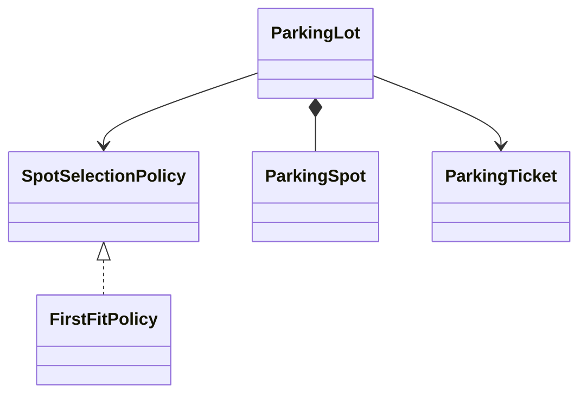
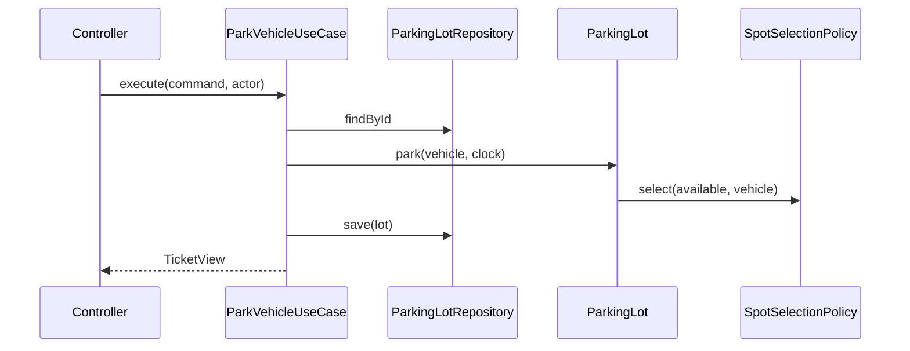

# 02 — Object modeling và UML vừa đủ

## Responsibility trước data

Class tốt trả lời được “nó biết gì, làm gì, bảo vệ rule nào?”. Class chỉ getter/setter thường đẩy nghiệp vụ vào service khổng lồ.

Dùng CRC:

| Class | Responsibilities | Collaborators |
|---|---|---|
| `ParkingLot` | allocate/release; giữ invariant occupancy | `SpotSelectionPolicy`, `TicketRepository` |
| `ParkingSpot` | xác nhận fit; transition available/occupied | `Vehicle` |
| `ParkingTicket` | lifecycle entry→paid→exited | `Clock`, `PricingPolicy` |

Walkthrough một use case bằng thẻ CRC để phát hiện object “God” hoặc responsibility vô chủ.

## Entity, Value Object, Service

- Entity có identity và lifecycle; equality thường theo ID, nhưng cẩn thận transient entity/JPA.
- Value Object định nghĩa bằng toàn bộ giá trị, immutable và tự validate: `Money`, `TimeRange`, `SeatId`.
- Domain service chứa operation nghiệp vụ không thuộc tự nhiên một entity/value object.
- Application service orchestration transaction/authorization/ports; không chứa rule lõi nếu domain object có thể giữ.

## Relationship

- **Association:** biết nhau nhưng lifecycle độc lập.
- **Aggregation:** whole-part yếu; part có thể sống riêng.
- **Composition:** whole sở hữu lifecycle của part.
- **Dependency:** dùng tạm qua parameter/local call.
- **Inheritance:** substitutability thật, không chỉ reuse code.

Ưu tiên giữ reference theo ID qua aggregate boundary để tránh object graph lớn và transaction mơ hồ.

## UML cần dùng

### Class diagram

Ghi public responsibility, cardinality và dependency direction. Không cần liệt kê mọi getter.



### Sequence diagram

Phù hợp orchestration và boundary:



### State diagram

Phù hợp ticket/order/machine:

```text
AVAILABLE --select--> RESERVED --pay--> SOLD
    ^                    |
    +------expire/cancel-+
```

## Naming

- Command bằng động từ: `ReserveSeat`, `CancelHold`.
- Entity bằng language của domain, tránh `Manager`, `Helper`, `Util`.
- Boolean diễn đạt predicate: `canFit`, `isExpiredAt`.
- Method giữ intention: `ticket.markPaid(payment)` tốt hơn `ticket.setStatus(PAID)`.
- Error mang business meaning: `SeatUnavailable`, không chỉ `RuntimeException`.

## Diagram anti-patterns

- Class diagram sinh tự động từ code nhưng không cho thấy decision.
- Mọi association đều bidirectional.
- Một `SystemManager` nối tất cả class.
- Interface trước mỗi implementation dù không có boundary/variation.
- Diagram và code khác nhau nhưng không có owner/version.
